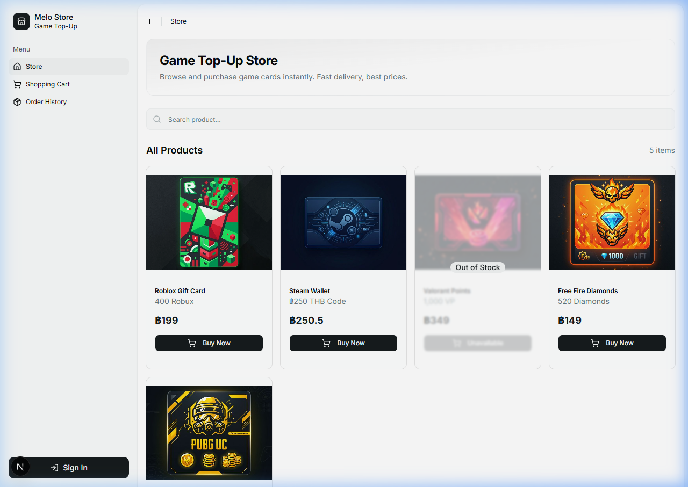
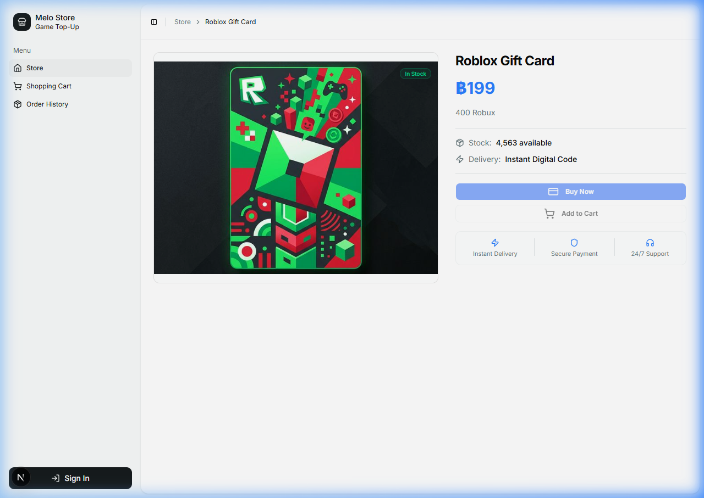
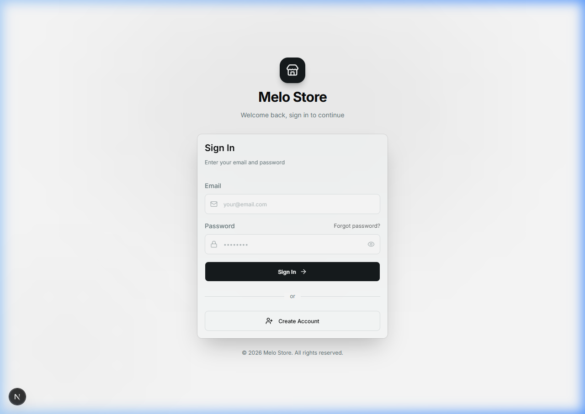
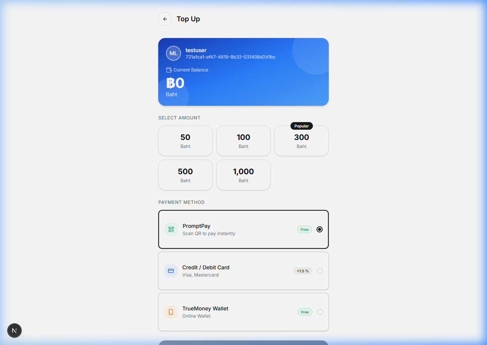

# Melo-nextjs-Store

A modern e-commerce storefront for digital products, featuring a secure user authentication system, product browsing, and wallet management.

## Project Preview
### Storefront & Products



### Authentication & Wallet



## Tech Stack
### Frontend
- **Framework:** [Next.js](https://nextjs.org/) (App Router)
- **Language:** TypeScript
- **Styling:** Tailwind CSS
- **UI Components:** shadcn/ui, Lucide React
- **State Management:** Zustand
- **Data Fetching:** Axios, Zod (Schema Validation)

### Backend
- **Framework:** Express.js
- **Language:** TypeScript
- **Database:** Prisma ORM with SQLite
- **Security:** JWT Authentication, Bcrypt (Password Hashing)
- **Logging:** Winston
- **Validation:** Zod

## Key Features
- **Secure Authentication:** User registration and login with JWT and secure cookie handling.
- **Product Store:** Browsing and searching digital products.
- **Wallet Management:** User balance tracking and transaction history.
- **Responsive Design:** Modern UI designed for a seamless user experience.

## AI-Assisted Development
This project leverages AI to accelerate development:
- **Design & UI:** AI helped prototype and structure the modern UI components and layout.
- **Code Optimization:** AI assisted in resolving complex logic, optimizing React hooks, and debugging backend integration.

## Getting Started

### Prerequisites
- Node.js (v20+)
- npm or pnpm

### Installation

1. **Clone the repository:**
   ```bash
   git clone <your-repo-url>
   cd Melo-nextjs-Store
   ```

2. **Setup Backend:**
   ```bash
   cd backend
   npm install
   # Configure environment variables (.env)
   npx prisma generate
   npm run dev
   ```

3. **Setup Frontend:**
   ```bash
   cd frontend
   npm install
   npm run dev
   ```

Open [http://localhost:3000](http://localhost:3000) to view the application.
