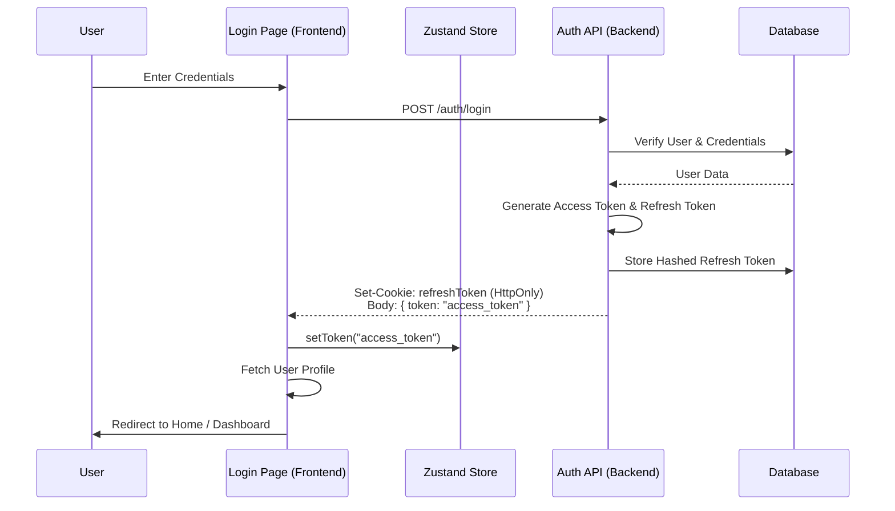
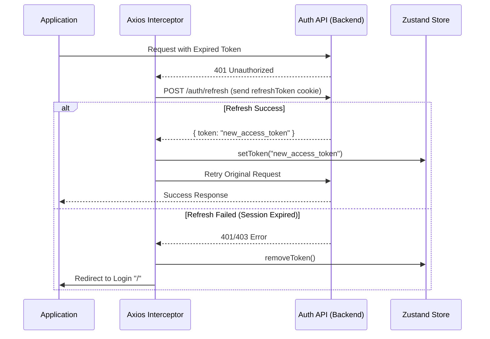

# Auth Module Review & Flow

สรุปการทำงานของระบบ Authentication ทั้ง Frontend และ Backend พร้อมข้อเสนอแนะในการพัฒนา

## 1. Authentication Flows

### A. Login Flow
กระบวนการเข้าสู่ระบบตั้งแต่กรอกข้อมูลจนถึงการเก็บ State

### B. Token Refresh Flow (Automatic)
กระบวนการ Refresh Token อัตโนมัติเมื่อ Access Token หมดอายุ (ใช้งานผ่าน Axios Interceptor)

---

## 2. Code Review (Frontend)

### ไฟล์ที่ตรวจสอบ:
- [auth.services.ts](file:///c:/Users/Administrator/Desktop/Melo-nextjs-Store/frontend/src/modules/auth/auth.services.ts)
- [auth.hook.ts](file:///c:/Users/Administrator/Desktop/Melo-nextjs-Store/frontend/src/modules/auth/auth.hook.ts)
- [axios.ts](file:///c:/Users/Administrator/Desktop/Melo-nextjs-Store/frontend/src/lib/axios.ts)

### ✅ จุดที่ดี:
1. **Axios Interceptor**: มีการทำ Automatic Retry และ Refresh Token ที่ค่อนข้างสมบูรณ์ จัดการเรื่อง `_retry` flag เพื่อป้องกัน infinite loop ได้ดี
2. **Separation of Concerns**: แยก logic ระหว่าง Service (API call), Store (State), และ Hook (Logic) ชัดเจน
3. **HttpOnly Cookie**: ใช้ cookie สำหรับ Refresh Token ช่วยป้องกัน XSS

### ⚠️ ข้อควรระวัง/จุดที่ปรับปรุงได้:
1. **Hardcoded URLs**: ใน [axios.ts](file:///c:/Users/Administrator/Desktop/Melo-nextjs-Store/frontend/src/lib/axios.ts) มีการใช้ `http://localhost:5000/api/auth/refresh` แบบ hardcode ในส่วนที่ Refresh Token (บรรทัดที่ 42) ควรใช้ `baseURL` หรือ `env` แทน
2. **Reactivity in Hooks**: ใน [auth.hook.ts](file:///c:/Users/Administrator/Desktop/Melo-nextjs-Store/frontend/src/modules/auth/auth.hook.ts) มีการใช้ `useAuthStore.getState()` เพื่อสั่ง action จริงๆ แล้วสามารถใช้ `const setToken = useAuthStore(s => s.setToken)` เพื่อความชัดเจนตาม pattern ของ Zustand ได้
3. **Error Handling**: ใน [handleLogin](file:///c:/Users/Administrator/Desktop/Melo-nextjs-Store/frontend/src/modules/auth/auth.hook.ts#9-19) มีการ throw `Error` ใหม่ ทำให้ข้อมูลบางอย่างจาก Axios Error ต้นทางอาจหายไป (เช่น status code)

---

## 3. Code Review (Backend)

### ไฟล์ที่ตรวจสอบ:
- [auth.controllers.ts](file:///c:/Users/Administrator/Desktop/Melo-nextjs-Store/backend/src/modules/auth/auth.controllers.ts)
- [auth.services.ts](file:///c:/Users/Administrator/Desktop/Melo-nextjs-Store/backend/src/modules/auth/auth.services.ts)

### ✅ จุดที่ดี:
1. **Password Security**: ใช้ `bcrypt` ในการ hash password (10 rounds) เป็นมาตรฐานที่ปลอดภัย
2. **Middleware Validation**: มีการใช้ `validate(AuthSchema)` ที่ route level ช่วยให้ controller สะอาด
3. **Logging**: มีการใช้ logger เก็บข้อมูล success/fail ของ auth events

### ⚠️ ข้อควรระวัง/จุดที่ปรับปรุงได้:
1. **Naming Inconsistency**:
   - [logoutServices](file:///c:/Users/Administrator/Desktop/Melo-nextjs-Store/backend/src/modules/auth/auth.services.ts#69-72) (มี s) vs [loginService](file:///c:/Users/Administrator/Desktop/Melo-nextjs-Store/frontend/src/modules/auth/auth.services.ts#9-13) (ไม่มี s)
   - `createUser` vs [registerService](file:///c:/Users/Administrator/Desktop/Melo-nextjs-Store/backend/src/modules/auth/auth.services.ts#7-18)
   - แนะนำให้ใช้ singular (service) ทั้งหมดเพื่อความเป็นระเบียบ
2. **Refresh Token Rotation**: ปัจจุบันระบบอัปเดต Refresh Token ใน DB ทุกครั้งที่ Login แต่ตอน Refresh จะไม่ออก Refresh Token ใหม่ (ส่งกลับแค่ Access Token)
   - *คำแนะนำ:* หากต้องการความปลอดภัยสูงสุด สามารถทำ "Refresh Token Rotation" โดยการออก RT ใหม่ทุกครั้งที่มีการ Refresh และยกเลิกอันเก่า
3. **Try-Catch in Controllers**: Controller ปัจจุบันไม่ได้ครอบด้วย try-catch แต่ดูเหมือนจะใช้ middleware จัดการ error (ถ้ามี base async handler ก็ดีครับ)

---

## 4. สรุปภาพรวม (Overview)

ระบบ Auth ของโครงการนี้ **วางโครงสร้างมาได้ดีมาก** (Architecture is solid). การใช้ Zustand ร่วมกับ Axios Interceptor เป็นแนวทางที่ Modern และ Scalable สำหรับ Next.js

> [!TIP]
> **Next Step:**
> - จัดการเรื่อง Environment Variables ให้ครอบคลุมทุกจุด (โดยเฉพาะใน [axios.ts](file:///c:/Users/Administrator/Desktop/Melo-nextjs-Store/frontend/src/lib/axios.ts))
> - เพิ่ม loading state ในระดับ global เมื่อกำลังทำการ Refresh Token เพื่อป้องกัน UI กระตุก (Flicker) เมื่อ Token หมดอายุตอนเปลี่ยนหน้า
